# GOODCABS Operational Performance & Passenger Analysis

## 📌 Project Overview

Goodcabs is a fast-growing cab service company operating across ten tier-2 cities in India. Established two years ago, the company differentiates itself by empowering local drivers and delivering an excellent passenger experience. As part of its 2024 strategic growth plan, Goodcabs aims to evaluate key performance metrics across its transportation operations.

This Power BI project provides actionable insights for the Chief of Operations to support data-driven decision-making around trip performance, driver efficiency, and passenger satisfaction.

---

# Problem Statement

Goodcabs has set ambitious 2024 performance targets to expand its market presence in the Indian transportation and mobility sector. To support these goals, the Chief of Operations (Bruce Haryali) requires a detailed analysis of the company’s operational performance, focusing on:

* Trip volume trends
* Passenger satisfaction
* Repeat passenger behavior
* Trip distribution across segments
* Ratio of new vs. repeat passengers
* City-level performance and growth potential
* Operational Performance KPIs

---

## Analysis was conducted on 6 months (January - June) data

* Max Trip Distance - 45Km
* Min Trip Distance - 5Km

### Trip Category

* Short (5-15)
* Medium (16-30)
* Long (31-45)

### City Category

#### Tourism City

* Jaipur
* Kochi
* Chandigarh
* Mysore

#### Business City

* Lucknow
* Surat
* Indore
* Vadodara
* Visakhapatnam
* Coimbatore

---

# 🔷 1. Trip Performance Insights

## Trip Distribution by City

### Top-performing cities by total trips

* Jaipur – 76.9K (Strongest city)
* Lucknow – 64.3K
* Surat – 54.8K
* Kochi – 50.7K
* Indore – 42.4K

### Low-performing cities

* Chandigarh – 38.9K
* Vadodara – 32K
* Visakhapatnam – 28.3K
* Coimbatore – 21.1K
* Mysore – 16.2K (lowest)

---

## Month-wise Trip Demand Trend

* Peak Month : February – 75.4K
* Dip in June : 62.5K (seasonal slowdown)

---

## Weekday vs Weekend Trips

* Weekdays: 238K (44%)
* Weekends: 188K (56%)

---

## Trip Distribution by Category

* Medium Trips: 182K (43%)
* Short Trips: 179K (42%)
* Long Trips: 65K (15%)

### Implication

Short and medium-distance rides dominate—ideal for dynamic pricing and local driver staffing optimization.

---

## City Performance by Day Type

* Jaipur: Weekday 32K vs Weekend 44K → Strong tourism/weekend demand
* Mysore: Weekend 10K vs Weekday 6K → Tourism-centric
* Kochi: Weekend 28K vs Weekday 23K → Tourism-centric
* Lucknow: Weekday-driven (50K vs 15K) → Business hub

### Strategy

Categorize cities as Business Cities vs Tourism Cities and optimize driver allocation accordingly.

---

## Fare, Distance & Revenue

### Average Fare Per Trip

* Highest: Jaipur – ₹483.92
* Lowest: Surat – ₹117.27

### Average Trip Distance

* Highest: Jaipur – 30 km
* Lowest: Surat – 11 km

### Fare Per KM

* Highest: Jaipur – ₹16.12
* Lowest: Vadodara – ₹10.29

### Total Revenue Contribution

* Highest: Jaipur – ₹37.21M
* Lowest: Coimbatore – ₹3.52M

### Insight

Mysore is a tourism city, but compared to other tourism hubs, it ranks in the bottom 3 among all with the lowest revenue at just 4M.

Jaipur is the economic engine for Goodcabs / low-cost cities like Surat and Vadodara need fare restructuring.

---

## Monthly Revenue Trend

* Peak: February – ₹19.9M
* Lowest: June – ₹15.4M

Revenue follows trip demand — highlighting seasonal fluctuation.

---

## Driver Rating by City

### Top Rated

* Kochi
* Visakhapatnam
* Jaipur
* Mysore – 8.9

### Low Rated

* Vadodara
* Lucknow
* Surat – 6.6

---

# 🔷 2. Passenger Performance Insights

## Repeat Passenger Rate by City

### Top Repeat-Passenger Cities

* Surat – 42.63% (Highest)
* Lucknow – 37.12%
* Indore – 32.68%
* Vadodara – 30.03%
* Visakhapatnam – 28.61%

### Lowest Retention Cities

* Coimbatore – 23.05%
* Kochi – 22.40%
* Chandigarh – 21.14%
* Jaipur – 17.43%
* Mysore – 11.23% (Lowest)

### Insight

Despite Jaipur having the highest trips, its repeat passenger rate is very low, indicating service gaps or fare sensitivity.

---

## Passenger Rating by City

### Highest

* Mysore
* Jaipur
* Kochi
* Visakhapatnam – 8.6

### Lowest

* Vadodara
* Lucknow
* Surat – 6.5

### Insight

Low-rating cities correlate with weaker customer loyalty and higher churn risk.

---

## New vs Repeat Passengers (City-wise)

### Top 3 Cities

* Jaipur : New 46K | Repeat 10K
* Kochi : New 26K | Repeat 8K
* Chandigarh : New 19K | Repeat 5K

### Bottom 3 Cities

* Surat : New 12K | Repeat 9K
* Vadodara : New 10K | Repeat 4K
* Coimbatore : New 9K | Repeat 3K

---

## New vs Repeat Passengers (Monthly)

* New passengers decline from 36K → 22K
* Repeat passengers grow from 8K → 12K (Jan–May)

---

## Revenue & Trips Contribution

### Revenue

* Repeat passengers contribute more revenue (51%) than new passengers (49%)

### Trips

* Repeat : 249K (58%)
* New : 177K (42%)

### Insight

Repeat customers are the financial backbone.

---

# 🔷 3. Target & Operational Performance Insights

## 1️⃣ Trip Target Achievement

### Top Performing Cities

These cities exceeded their trip targets, showing strong operational efficiency:

* Mysore: +20.28% (+2,738 trips)
* Jaipur: +13.91% (+9,388 trips)
* Kochi: +2.43% (+1,202 trips)
* Coimbatore: +0.50% (+104 trips)

### Underperforming Cities

These cities did not meet their trip targets:

* Vadodara: –14.60% (–5,474 trips)
* Lucknow: –10.70% (–7,701 trips)
* Surat: –3.70% (–2,157 trips)
* Indore: –2.40% (–1,044 trips)

---

## 2️⃣ New Passenger Target Achievement

### Top Performing Cities

These cities exceeded their new passenger acquisition targets:

* Coimbatore: +13.52% (+1,014 passengers) — Best performer
* Surat: +10.72% (+1,126 passengers)
* Indore: +5.41% (+763 passengers)
* Lucknow: +4.23% (+660 passengers)
* Vadodara: +2.29% (+227 passengers)

### Cities Falling Short

These cities missed their new passenger targets:

* Jaipur: –15% (–8,144 passengers) — Largest shortfall
* Chandigarh: –10% (–2,092 passengers)

### 🌟 Key Insight

Coimbatore is the only city that achieved both:

* Trip targets: +0.50%
* New passenger targets: +13.52%

---

## 3️⃣ Passenger Rating Target Achievement

### Achieved Target Rating

* Jaipur
* Mysore
* Kochi

### Missed Rating Targets

Most other cities, including Coimbatore despite strong trip and passenger performance.

---

## Demand Seasonality by City

### Peak Months

* February
* May
* April

### Low Months

* June
* January

---

## Repeat Trip Frequency

* Jaipur, Kochi, Mysore, Visakhapatnam show high 2-3 trip repeat rates, retention drops drastically after the 3rd trip.
* Chandigarh maintains consistency - steady repeat frequency across the 2–8 trip range, indicating a highly reliable customer base.
* Coimbatore, Lucknow, Surat, Vadodara dominate the 4–8 trip frequency segment, showing deeper market penetration & habitual usage patterns.
* Business cities show stronger repeat behavior, while tourism cities drive volume but struggle with retention.

---

## Business vs Tourism City Categories

### Total Trips

* Business: 243K (57%)
* Tourism: 183K (43%)

### Insight

Business cities drive stable weekday revenue while tourism cities fuel weekend and seasonal peaks.

---

## Target Summary (Company-Level)

* Total Trips: 426K vs Target 429K → Slight miss
* New Passengers: 177K vs 185K → Missed target
* Passenger Rating: 7.6 vs 7.9 → Quality gap

---

### Business Request - 1: City-Level Fare and Trip Summary Report

* Generate a report that displays the total trips, average fare per km, average fare per trip, and the percentage contribution of each city's trips to the overall   trips. This report will help in assessing trip volume, pricing efficiency, and each city's contribution to the overall trip count.

  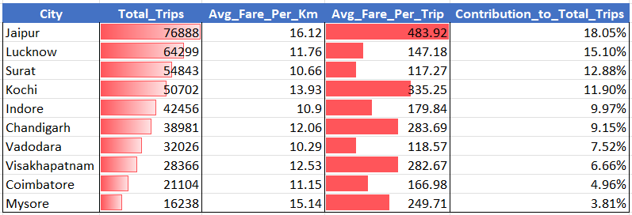

---

### Business Request - 2: Monthly City-Level Trips Target Performance Report

* Generate a report that evaluates the target performance for trips at the monthly and city level. For each city and month, compare the actual total trips with the target trips and categorise the performance as follows:
* If actual trips are greater than target trips, mark it as "Above Target".
* If actual trips are less than or equal to target trips, mark it as "Below Target".
* Additionally, calculate the % difference between actual and target trips to quantify the performance gap.

  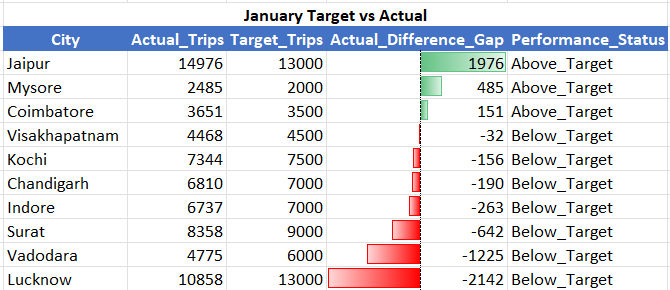
  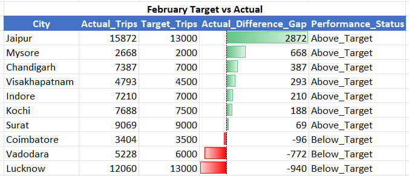
  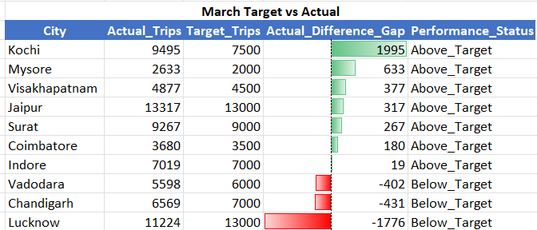
  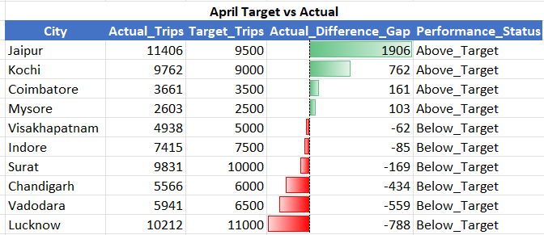
  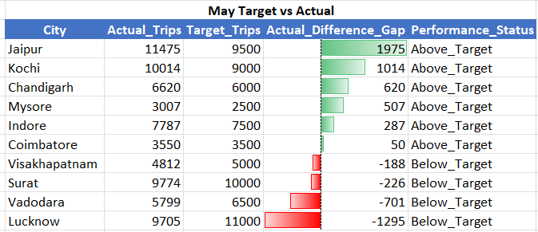
  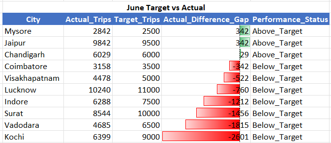

---

### Business Request - 3: City-Level Repeat Passenger Trip Frequency Report

* Generate a report that shows the percentage distribution of repeat passengers by the number of trips they have taken in each city. Calculate the percentage of repeat passengers who took 2 trips, 3 trips, and so on, up to 10 trips. Each column should represent a trip count category, displaying the percentage of repeat passengers who fall into that category out of the total repeat passengers for that city.
* Fields: city_name, 2-Trips, 3-Trips, 4-Trips, 5-Trips, 6-Trips, 7-Trips, 8-Trips, 9-Trips, 10-Trips
  
  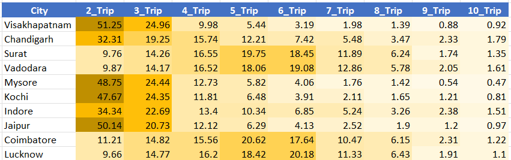

---

### Business Request - 4: Identify Cities with Highest and Lowest Total New Passengers

* Generate a report that calculates the total new passengers for each city and ranks them based on this value. Identify the top 3 cities with the highest number of new passengers as well as the bottom 3 cities with the lowest number of new passengers, categorising them as "Top 3" or "Bottom 3" accordingly.
  
  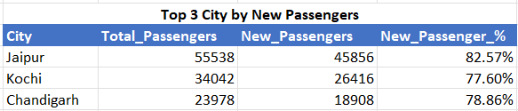
  

---

### Business Request - 5: Identify Month with Highest Revenue for Each City

* Generate a report that identifies the month with the highest revenue for each city. For each city, display the month_name, the revenue amount for that month, and the percentage contribution of that month's revenue to the city's total revenue.
  
  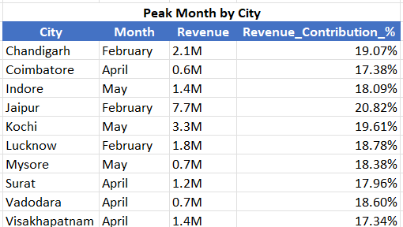

---

### Business Request - 6: Repeat Passenger Rate Analysis

* Generate a report that calculates two metrics:
* Monthly Repeat Passenger Rate: Calculate the repeat passenger rate for each city and month by comparing the number of repeat passengers to the total passengers.
* City-wide Repeat Passenger Rate: Calculate the overall repeat passenger rate for each city, considering all passengers across months.
  
  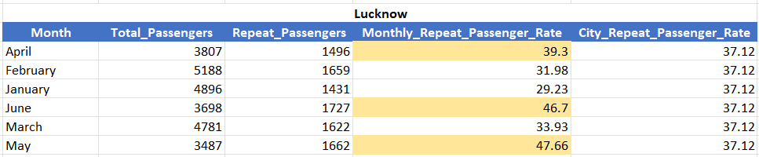
  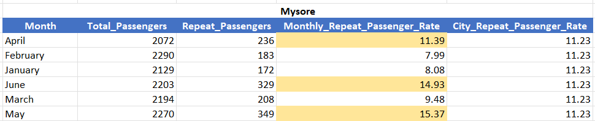
  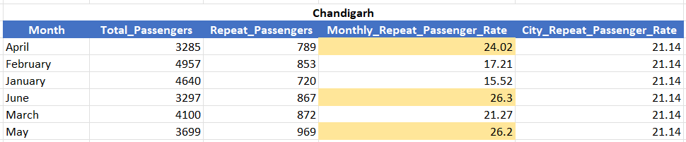
  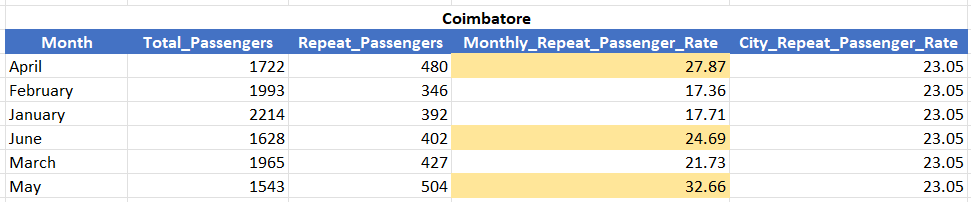
  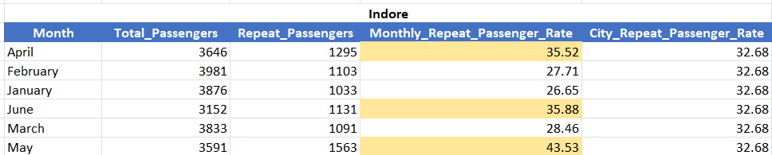
  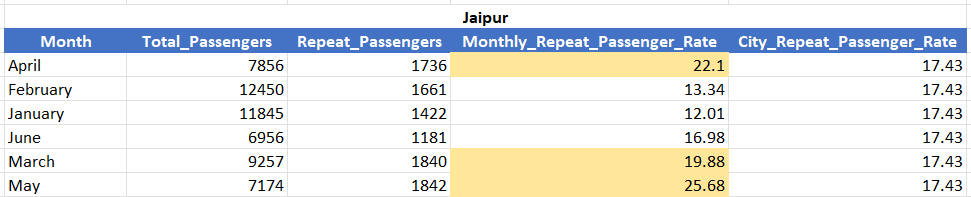
  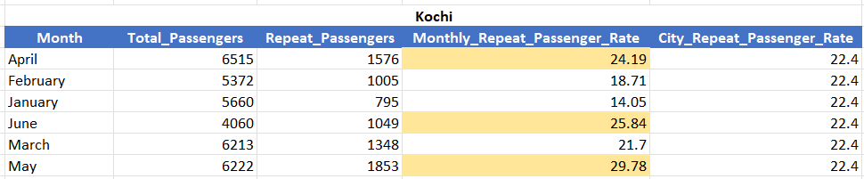
  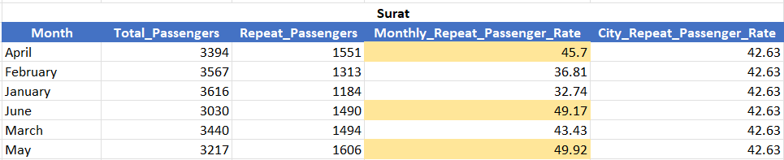
  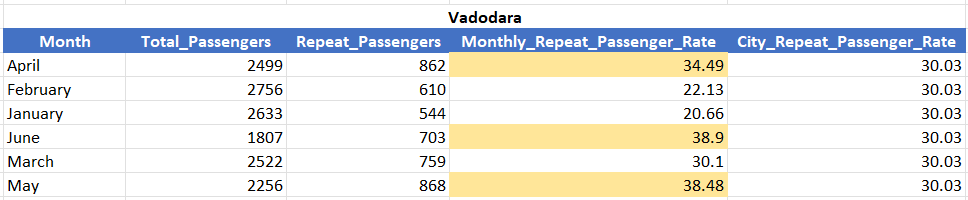
  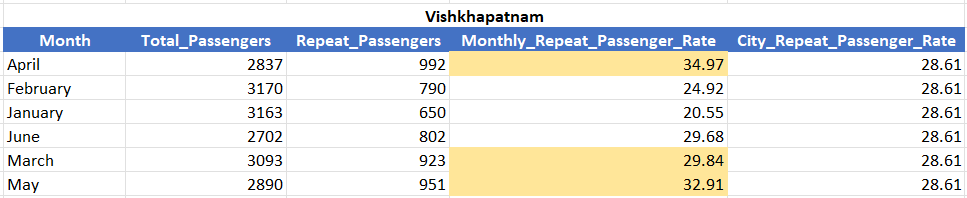

---

1.Top and Bottom Performing Cities Identify the top 3 and bottom 3 cities by total trips over the entire analysis period.

  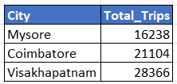    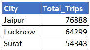

---

2.Highest and Lowest Repeat Passenger Rate (RPR%) by City and Month By City: Analyse the Repeat Passenger Rate (RPR%) for each city across the six-month period. Identify the top 2 and bottom 2 cities based on their RPR% to determine which locations have the strongest and weakest rates.

  * By Month: Similarly, analyse the RPR% by month across all cities and identify the months with the highest and lowest repeat passenger rates.
   
  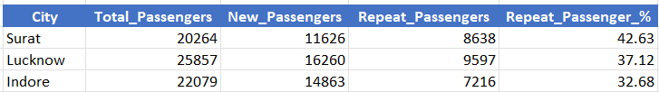
  
  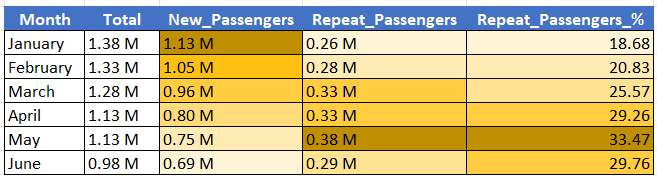

---

3.Average Ratings by City and Passenger Type Calculate the average passenger and driver ratings for each city, segmented by passenger type (new vs. repeat). Identify cities with the highest and lowest average ratings.
   
  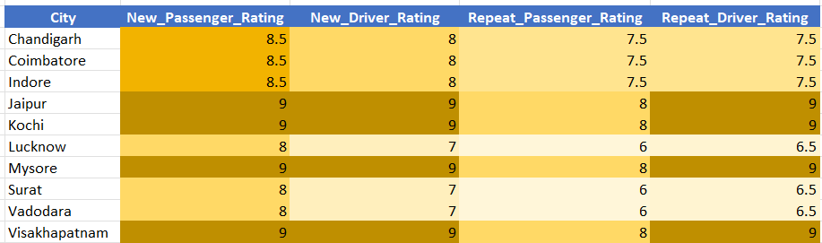 
  
  
  
  
---

4.Average_fare_per_trip and revenue by city
   
  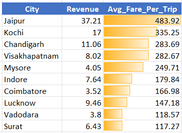

---

5.City wise revenue and average fare per trip based on day type
   
  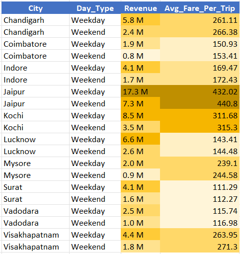

---

6.Weekday vs Weekend revenue & average fare per trip
   
  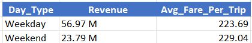

---

7.Weekday vs Weekend new & repeat passengers
   
  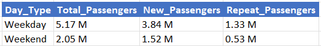

---

# 📊 Dashboard Views

## Live Dashboard Link

Click Here to view the dashboard: [GoodCabs Live Dashboard](https://app.powerbi.com/view?r=eyJrIjoiNzQ4NzkyM2MtZmU5Yi00ZjU4LWFjNjMtZjI4NjczOWM1NGQxIiwidCI6ImM2ZTU0OWIzLTVmNDUtNDAzMi1hYWU5LWQ0MjQ0ZGM1YjJjNCJ9)

---

## Data Model View

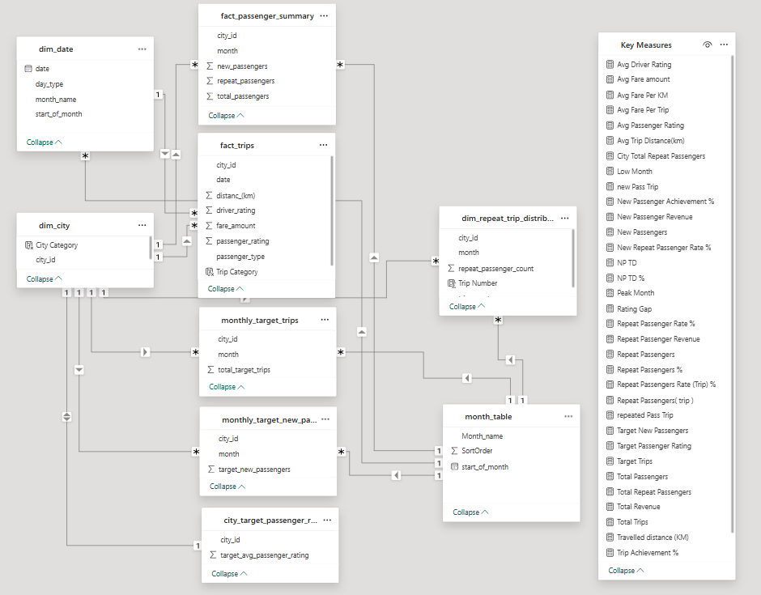

---

## Home Page View

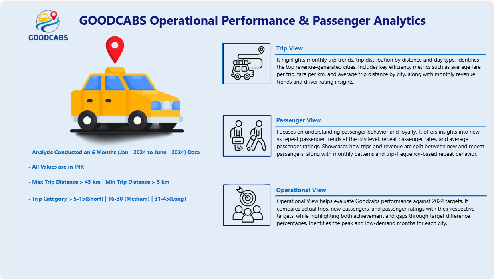

---

## Trips View

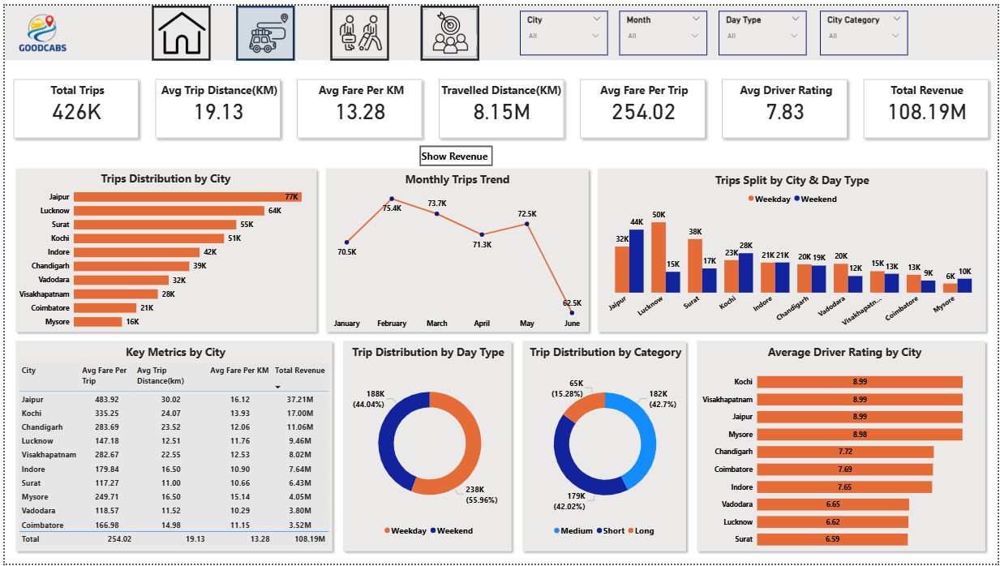

---

## Passenger View

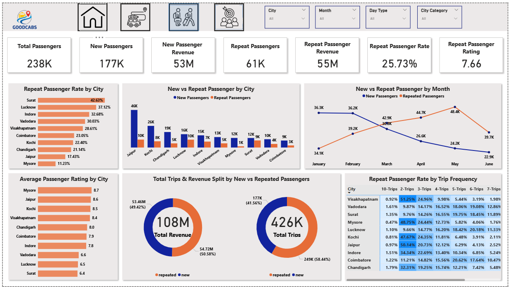

---

## Target View

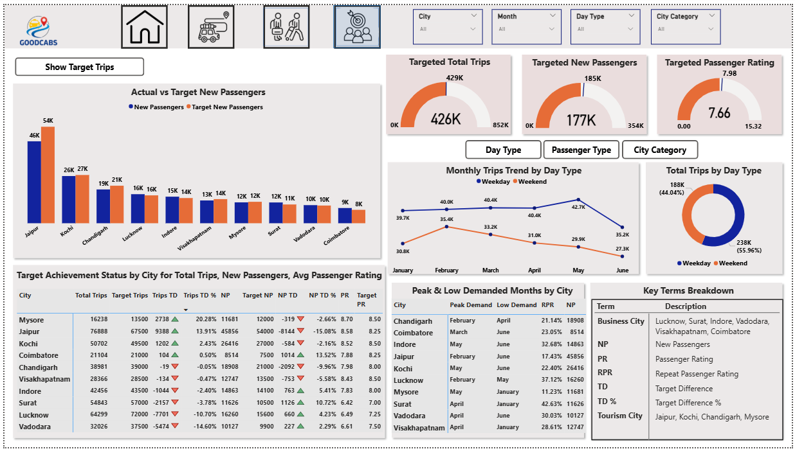

---

# 🛠️ Tools Used

* Power BI Desktop
* Power Query
* DAX (Data Analysis Expressions)
* Data Modeling (Star Schema)
* Microsoft Excel
* Data Visualization
* Business Intelligence & KPI Analysis
* SQL

---

# 👨‍💻 Author

**Siya Halarnkar**

Data Analyst Portfolio Project – Codebasics Resume Challenge

Connect with me on LinkedIn and explore more projects on GitHub.
