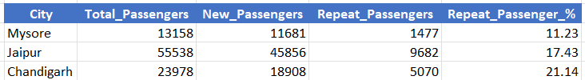

# GOODCABS Operational Performance & Passenger Analysis

## 📌 Project Overview

Goodcabs is a fast-growing cab service company operating across ten tier-2 cities in India. Established two years ago, the company differentiates itself by empowering local drivers and delivering an excellent passenger experience. As part of its 2024 strategic growth plan, Goodcabs aims to evaluate key performance metrics across its transportation operations.

This Power BI project provides actionable insights for the Chief of Operations to support data-driven decision-making around trip performance, driver efficiency, and passenger satisfaction.

---

# Problem Statement

Goodcabs has set ambitious 2024 performance targets to expand its market presence in the Indian transportation and mobility sector. To support these goals, the Chief of Operations (Bruce Haryali) requires a detailed analysis of the company’s operational performance, focusing on:

* Trip volume trends
* Passenger satisfaction
* Repeat passenger behavior
* Trip distribution across segments
* Ratio of new vs. repeat passengers
* City-level performance and growth potential
* Operational Performance KPIs

---

## Analysis was conducted on 6 months (January - June) data

* Max Trip Distance - 45Km
* Min Trip Distance - 5Km

### Trip Category

* Short (5-15)
* Medium (16-30)
* Long (31-45)

### City Category

#### Tourism City

* Jaipur
* Kochi
* Chandigarh
* Mysore

#### Business City

* Lucknow
* Surat
* Indore
* Vadodara
* Visakhapatnam
* Coimbatore

---

# 🔷 1. Trip Performance Insights

## Trip Distribution by City

### Top-performing cities by total trips

* Jaipur – 76.9K (Strongest city)
* Lucknow – 64.3K
* Surat – 54.8K
* Kochi – 50.7K
* Indore – 42.4K

### Low-performing cities

* Chandigarh – 38.9K
* Vadodara – 32K
* Visakhapatnam – 28.3K
* Coimbatore – 21.1K
* Mysore – 16.2K (lowest)

---

## Month-wise Trip Demand Trend

* Peak Month : February – 75.4K
* Dip in June : 62.5K (seasonal slowdown)

---

## Weekday vs Weekend Trips

* Weekdays: 238K (44%)
* Weekends: 188K (56%)

---

## Trip Distribution by Category

* Medium Trips: 182K (43%)
* Short Trips: 179K (42%)
* Long Trips: 65K (15%)

### Implication

Short and medium-distance rides dominate—ideal for dynamic pricing and local driver staffing optimization.

---

## City Performance by Day Type

* Jaipur: Weekday 32K vs Weekend 44K → Strong tourism/weekend demand
* Mysore: Weekend 10K vs Weekday 6K → Tourism-centric
* Kochi: Weekend 28K vs Weekday 23K → Tourism-centric
* Lucknow: Weekday-driven (50K vs 15K) → Business hub

### Strategy

Categorize cities as Business Cities vs Tourism Cities and optimize driver allocation accordingly.

---

## Fare, Distance & Revenue

### Average Fare Per Trip

* Highest: Jaipur – ₹483.92
* Lowest: Surat – ₹117.27

### Average Trip Distance

* Highest: Jaipur – 30 km
* Lowest: Surat – 11 km

### Fare Per KM

* Highest: Jaipur – ₹16.12
* Lowest: Vadodara – ₹10.29

### Total Revenue Contribution

* Highest: Jaipur – ₹37.21M
* Lowest: Coimbatore – ₹3.52M

### Insight

Mysore is a tourism city, but compared to other tourism hubs, it ranks in the bottom 3 among all with the lowest revenue at just 4M.

Jaipur is the economic engine for Goodcabs / low-cost cities like Surat and Vadodara need fare restructuring.

---

## Monthly Revenue Trend

* Peak: February – ₹19.9M
* Lowest: June – ₹15.4M

Revenue follows trip demand — highlighting seasonal fluctuation.

---

## Driver Rating by City

### Top Rated

* Kochi
* Visakhapatnam
* Jaipur
* Mysore – 8.9

### Low Rated

* Vadodara
* Lucknow
* Surat – 6.6

---

# 🔷 2. Passenger Performance Insights

## Repeat Passenger Rate by City

### Top Repeat-Passenger Cities

* Surat – 42.63% (Highest)
* Lucknow – 37.12%
* Indore – 32.68%
* Vadodara – 30.03%
* Visakhapatnam – 28.61%

### Lowest Retention Cities

* Coimbatore – 23.05%
* Kochi – 22.40%
* Chandigarh – 21.14%
* Jaipur – 17.43%
* Mysore – 11.23% (Lowest)

### Insight

Despite Jaipur having the highest trips, its repeat passenger rate is very low, indicating service gaps or fare sensitivity.

---

## Passenger Rating by City

### Highest

* Mysore
* Jaipur
* Kochi
* Visakhapatnam – 8.6

### Lowest

* Vadodara
* Lucknow
* Surat – 6.5

### Insight

Low-rating cities correlate with weaker customer loyalty and higher churn risk.

---

## New vs Repeat Passengers (City-wise)

### Top 3 Cities

* Jaipur : New 46K | Repeat 10K
* Kochi : New 26K | Repeat 8K
* Chandigarh : New 19K | Repeat 5K

### Bottom 3 Cities

* Surat : New 12K | Repeat 9K
* Vadodara : New 10K | Repeat 4K
* Coimbatore : New 9K | Repeat 3K

---

## New vs Repeat Passengers (Monthly)

* New passengers decline from 36K → 22K
* Repeat passengers grow from 8K → 12K (Jan–May)

---

## Revenue & Trips Contribution

### Revenue

* Repeat passengers contribute more revenue (51%) than new passengers (49%)

### Trips

* Repeat : 249K (58%)
* New : 177K (42%)

### Insight

Repeat customers are the financial backbone.

---

# 🔷 3. Target & Operational Performance Insights

## 1️⃣ Trip Target Achievement

### Top Performing Cities

These cities exceeded their trip targets, showing strong operational efficiency:

* Mysore: +20.28% (+2,738 trips)
* Jaipur: +13.91% (+9,388 trips)
* Kochi: +2.43% (+1,202 trips)
* Coimbatore: +0.50% (+104 trips)

### Underperforming Cities

These cities did not meet their trip targets:

* Vadodara: –14.60% (–5,474 trips)
* Lucknow: –10.70% (–7,701 trips)
* Surat: –3.70% (–2,157 trips)
* Indore: –2.40% (–1,044 trips)

---

## 2️⃣ New Passenger Target Achievement

### Top Performing Cities

These cities exceeded their new passenger acquisition targets:

* Coimbatore: +13.52% (+1,014 passengers) — Best performer
* Surat: +10.72% (+1,126 passengers)
* Indore: +5.41% (+763 passengers)
* Lucknow: +4.23% (+660 passengers)
* Vadodara: +2.29% (+227 passengers)

### Cities Falling Short

These cities missed their new passenger targets:

* Jaipur: –15% (–8,144 passengers) — Largest shortfall
* Chandigarh: –10% (–2,092 passengers)

### 🌟 Key Insight

Coimbatore is the only city that achieved both:

* Trip targets: +0.50%
* New passenger targets: +13.52%

---

## 3️⃣ Passenger Rating Target Achievement

### Achieved Target Rating

* Jaipur
* Mysore
* Kochi

### Missed Rating Targets

Most other cities, including Coimbatore despite strong trip and passenger performance.

---

## Demand Seasonality by City

### Peak Months

* February
* May
* April

### Low Months

* June
* January

---

## Repeat Trip Frequency

* Jaipur, Kochi, Mysore, Visakhapatnam show high 2-3 trip repeat rates, retention drops drastically after the 3rd trip.
* Chandigarh maintains consistency - steady repeat frequency across the 2–8 trip range, indicating a highly reliable customer base.
* Coimbatore, Lucknow, Surat, Vadodara dominate the 4–8 trip frequency segment, showing deeper market penetration & habitual usage patterns.
* Business cities show stronger repeat behavior, while tourism cities drive volume but struggle with retention.

---

## Business vs Tourism City Categories

### Total Trips

* Business: 243K (57%)
* Tourism: 183K (43%)

### Insight

Business cities drive stable weekday revenue while tourism cities fuel weekend and seasonal peaks.

---

## Target Summary (Company-Level)

* Total Trips: 426K vs Target 429K → Slight miss
* New Passengers: 177K vs 185K → Missed target
* Passenger Rating: 7.6 vs 7.9 → Quality gap

---

### Business Request - 1: City-Level Fare and Trip Summary Report

* Generate a report that displays the total trips, average fare per km, average fare per trip, and the percentage contribution of each city's trips to the overall   trips. This report will help in assessing trip volume, pricing efficiency, and each city's contribution to the overall trip count.

  ```sql
  WITH city_stats AS (
    SELECT
        c.city_name,
        COUNT(*) AS total_trips,
        SUM(t.distance_travelled_km) AS total_travelled_distance,
        SUM(t.fare_amount) AS total_revenue
    FROM dim_city c 
    JOIN fact_trips t 
        ON c.city_id = t.city_id
    GROUP BY c.city_name )
  SELECT 
    city_name,
    total_trips,
    ROUND(total_revenue / total_travelled_distance, 2) AS avg_fare_per_km,
    ROUND(total_revenue / total_trips, 2) AS avg_fare_per_trip,
    ROUND(total_trips*100 / (SELECT COUNT(*) FROM fact_trips), 2) AS contribution_to_total_trips
  FROM city_stats;
  ```

  

---

### Business Request - 2: Monthly City-Level Trips Target Performance Report

* Generate a report that evaluates the target performance for trips at the monthly and city level. For each city and month, compare the actual total trips with the target trips and categorise the performance as follows:
* If actual trips are greater than target trips, mark it as "Above Target".
* If actual trips are less than or equal to target trips, mark it as "Below Target".
* Additionally, calculate the % difference between actual and target trips to quantify the performance gap.

  ```sql
  WITH city_stats AS (
    SELECT
        MONTHNAME(t.date) AS month_name, 
        c.city_id,
        c.city_name,
        COUNT(*) AS total_trips
    FROM
        dim_city c
    JOIN
        fact_trips t ON c.city_id = t.city_id
    GROUP BY
        MONTHNAME(t.date),
        c.city_id,
        c.city_name
  ),
  target_stats AS (
    SELECT
        MONTHNAME(target.month) AS month_name, 
        target.city_id,
        target.total_target_trips
    FROM
        targets_db.monthly_target_trips AS target),actual_vs_target AS (
    SELECT
        cts.city_name,
        cts.month_name, 
        cts.total_trips,
        ts.total_target_trips,
        (cts.total_trips - ts.total_target_trips) AS actual_difference_gap
    FROM
        city_stats cts
    JOIN
        target_stats ts
        ON cts.month_name = ts.month_name AND cts.city_id = ts.city_id
  )
  SELECT
    city_name,
    month_name, 
    total_trips AS actual_trips,
    total_target_trips AS target_trips,
    actual_difference_gap,
    CASE
        WHEN total_trips > total_target_trips THEN 'Above_Target'
        ELSE 'Below_Target'
    END AS performance_status
  FROM
    actual_vs_target
  ORDER BY
    month_name; 
  ```

  
  
  
  
  
  

---

### Business Request - 3: City-Level Repeat Passenger Trip Frequency Report

* Generate a report that shows the percentage distribution of repeat passengers by the number of trips they have taken in each city. Calculate the percentage of repeat passengers who took 2 trips, 3 trips, and so on, up to 10 trips. Each column should represent a trip count category, displaying the percentage of repeat passengers who fall into that category out of the total repeat passengers for that city.
* Fields: city_name, 2-Trips, 3-Trips, 4-Trips, 5-Trips, 6-Trips, 7-Trips, 8-Trips, 9-Trips, 10-Trips

  ```sql
  with trips as(
  select 
	c.city_name,
    sum(rtp.repeat_passenger_count) as total_trips,
    sum(case when rtp.trip_count='2-Trips' then repeat_passenger_count end) as two_trips,
     sum(case when rtp.trip_count='3-Trips' then repeat_passenger_count end) as three_trips,
      sum(case when rtp.trip_count='4-Trips' then repeat_passenger_count end) as four_trips,
       sum(case when rtp.trip_count='5-Trips' then repeat_passenger_count end) as five_trips,
        sum(case when rtp.trip_count='6-Trips' then repeat_passenger_count end) as six_trips,
         sum(case when rtp.trip_count='7-Trips' then repeat_passenger_count end) as seven_trips,
          sum(case when rtp.trip_count='8-Trips' then repeat_passenger_count end) as eight_trips,
           sum(case when rtp.trip_count='9-Trips' then repeat_passenger_count end) as nine_trips,
            sum(case when rtp.trip_count='10-Trips' then repeat_passenger_count end) as ten_trips
	from dim_repeat_trip_distribution  rtp
	join dim_city c 
	on rtp.city_id=c.city_id
	group by c.city_name
  )
  select
	city_name,
	round(two_trips/total_trips*100,2) as Trip_2,
	round(three_trips/total_trips*100,2) as Trip_3,
	round(four_trips/total_trips*100,2) as Trip_4,
	round(five_trips/total_trips*100,2) as Trip_5,
	round(six_trips/total_trips*100,2) as Trip_6,
	round(seven_trips/total_trips*100,2) as Trip_7,
	round(eight_trips/total_trips*100,2) as Trip_8,
	round(nine_trips/total_trips*100,2) as Trip_9,
	round(ten_trips/total_trips*100,2) as Trip_10
  from trips;
  ```
  
  

---

### Business Request - 4: Identify Cities with Highest and Lowest Total New Passengers

* Generate a report that calculates the total new passengers for each city and ranks them based on this value. Identify the top 3 cities with the highest number of new passengers as well as the bottom 3 cities with the lowest number of new passengers, categorising them as "Top 3" or "Bottom 3" accordingly.

  ```sql
  select
	c.city_name,
	sum(s.total_passengers) as total_passengers,
	sum(s.new_passengers) as new_passengers,
	round(sum(s.new_passengers)/sum(s.total_passengers)*100,2) as new_passenger_pct
  from
	fact_passenger_summary s
  join
	dim_city c on s.city_id=c.city_id
	group by
		c.city_name
	order by
		sum(s.new_passengers) asc
	limit 3;
  ```

  
  

---

### Business Request - 5: Identify Month with Highest Revenue for Each City

* Generate a report that identifies the month with the highest revenue for each city. For each city, display the month_name, the revenue amount for that month, and the percentage contribution of that month's revenue to the city's total revenue.
  
  ```sql
  WITH monthly_revenue AS (
    -- Step 1: Calculate revenue per city, per month
    SELECT
        c.city_name,
        MONTHNAME(t.date) AS month_name,
        SUM(t.fare_amount) AS monthly_revenue
    FROM
        fact_trips t
    JOIN
        dim_city c ON t.city_id = c.city_id
    GROUP BY
        c.city_name,
        MONTHNAME(t.date)
  ),
  city_total_revenue AS (
    SELECT
        c.city_name,
        SUM(t.fare_amount) AS total_city_revenue
    FROM
        fact_trips t
    JOIN
        dim_city c ON t.city_id = c.city_id
    GROUP BY
        c.city_name
  ),
  revenue_ranking as(
  SELECT
    mr.city_name,
    mr.month_name,
    mr.monthly_revenue AS revenue,
    ROUND(mr.monthly_revenue / ctr.total_city_revenue * 100, 2) AS revenue_share,
    dense_rank() over(partition by mr.city_name order by mr.monthly_revenue desc) as rnk
  FROM
    monthly_revenue mr
  JOIN
    city_total_revenue ctr ON mr.city_name = ctr.city_name
  )
  select
  city_name,
  month_name,
  revenue,
  revenue_share
  from revenue_ranking 
  where rnk=1;

  ```
  
  

---

### Business Request - 6: Repeat Passenger Rate Analysis

* Generate a report that calculates two metrics:
* Monthly Repeat Passenger Rate: Calculate the repeat passenger rate for each city and month by comparing the number of repeat passengers to the total passengers.
* City-wide Repeat Passenger Rate: Calculate the overall repeat passenger rate for each city, considering all passengers across months.

  ```sql
   WITH monthly_stats AS (
    SELECT
        s.city_id,
        c.city_name,
        s.month,
        MONTHNAME(s.month) AS month_name,
        s.total_passengers,
        s.repeat_passengers,
        ROUND(s.repeat_passengers * 100.0 / s.total_passengers, 2) AS monthly_repeat_passenger_rate
    FROM
        fact_passenger_summary s
    JOIN
        dim_city c ON s.city_id = c.city_id
  )
  SELECT
    city_name,
    month_name AS month,
    total_passengers,
    repeat_passengers,
    monthly_repeat_passenger_rate,
    ROUND(
        SUM(repeat_passengers) OVER (PARTITION BY city_name) * 100.0 /
        SUM(total_passengers) OVER (PARTITION BY city_name),
    2) AS city_repeat_passenger_rate
  FROM
    monthly_stats
  ORDER BY
    city_name,
    month; 
  ```
  
  
  
  
  
  
  
  
  
  
  

---

1.Top and Bottom Performing Cities Identify the top 3 and bottom 3 cities by total trips over the entire analysis period.

  ```sql
  SELECT
        c.city_name,
        COUNT(*) AS total_trips
    FROM dim_city c 
    JOIN fact_trips t 
        ON c.city_id = t.city_id
    GROUP BY c.city_name
    ORDER BY total_trips 
    LIMIT 3;
  ```

      

---

2.Highest and Lowest Repeat Passenger Rate (RPR%) by City and Month By City: Analyse the Repeat Passenger Rate (RPR%) for each city across the six-month period. Identify the top 2 and bottom 2 cities based on their RPR% to determine which locations have the strongest and weakest rates.

  * By Month: Similarly, analyse the RPR% by month across all cities and identify the months with the highest and lowest repeat passenger rates.

  ```sql
  select
c.city_name,
sum(s.total_passengers) as total_passengers,
sum(s.new_passengers) as new_passengers,
sum(s.repeat_passengers) as repeat_passengers,
round(sum(s.repeat_passengers)*100/sum(s.total_passengers),2) as repeat_contribution
from dim_city c 
join fact_passenger_summary s 
on c.city_id=s.city_id
group by c.city_name
order by repeat_contribution 
limit 3;
  ```

  
  

```sql
select 
monthname(d.start_of_month) as month_name,
sum(s.total_passengers) as total,
sum(s.new_passengers) as new_,
sum(s.repeat_passengers) as repeat_,
round(sum(s.repeat_passengers)*100/sum(s.total_passengers),2) repeat_contribution
from dim_date d 
join fact_passenger_summary s 
on monthname(d.start_of_month)=monthname(s.month)
group by monthname(d.start_of_month)
```

  

---

3.Average Ratings by City and Passenger Type Calculate the average passenger and driver ratings for each city, segmented by passenger type (new vs. repeat). Identify cities with the highest and lowest average ratings.

  ```sql
   select
c.city_name,
round(avg(case when t.passenger_type='new' then passenger_rating end),1) new_passenger_rating,
round(avg(case when t.passenger_type='new' then driver_rating end),1) new_driver_rating,
round(avg(case when t.passenger_type='repeated' then passenger_rating end),1) repeat_passenger_rating,
round(avg(case when t.passenger_type='repeated' then driver_rating end),1) repeat_driver_rating
from fact_trips t 
join dim_city c 
on t.city_id=c.city_id
group by c.city_name;
  ```

   
  
---

4.Average_fare_per_trip and revenue by city

  ```sql
   select
c.city_name,
round(sum(t.fare_amount)/1000000,2) as revenue,
round(avg(t.fare_amount),2) as avg_fare_per_trip
from fact_trips t 
join dim_city c 
on t.city_id=c.city_id
group by c.city_name
order by avg_fare_per_trip desc;
  ```
 
  

---

5.City wise revenue and average fare per trip based on day type

  ```sql
   select
c.city_name,
d.day_type,
round(sum(t.fare_amount),2) as revenue,
round(avg(t.fare_amount),2) as avg_fare_per_trip
from fact_trips t 
join dim_city c 
on t.city_id=c.city_id
join dim_date d 
on t.date=d.start_of_month
group by c.city_name,d.day_type
order by c.city_name;
  ``` 
  

---

6.Weekday vs Weekend revenue & average fare per trip

  ```sql
   select 
   d.day_type,
    ROUND(SUM(t.fare_amount) / 1000000, 2) AS revenue_in_millions,
    ROUND(AVG(t.fare_amount), 2) AS avg_fare_per_trip,
from fact_trips t 
join dim_date d 
on t.date=d.start_of_month
group by d.day_type;
  ```
 
  

---

7.Weekday vs Weekend new & repeat passengers

  ```sql
  select
d.day_type,
round(sum(s.total_passengers)/1000000,2) total_passengers,
round(sum(s.new_passengers)/1000000,2) new_passengers,
round(sum(s.repeat_passengers)/1000000,2) repeat_passengers
from dim_date d 
join fact_passenger_summary s 
on d.start_of_month=s.month
group by d.day_type;
  ```

  

---

# 📊 Dashboard Views

## Live Dashboard Link

Click Here to view the dashboard: [GoodCabs Live Dashboard](https://app.powerbi.com/view?r=eyJrIjoiNzQ4NzkyM2MtZmU5Yi00ZjU4LWFjNjMtZjI4NjczOWM1NGQxIiwidCI6ImM2ZTU0OWIzLTVmNDUtNDAzMi1hYWU5LWQ0MjQ0ZGM1YjJjNCJ9)

---

## Data Model View


---

## Home Page View


---

## Trips View


---

## Passenger View


---

## Target View


---

# 🛠️ Tools Used

* Power BI Desktop
* Power Query
* DAX (Data Analysis Expressions)
* Data Modeling (Star Schema)
* Microsoft Excel
* Data Visualization
* Business Intelligence & KPI Analysis
* SQL

---

# 👨‍💻 Author

**Siya Halarnkar**

Data Analyst Portfolio Project – Codebasics Resume Challenge

Connect with me on LinkedIn and explore more projects on GitHub.
